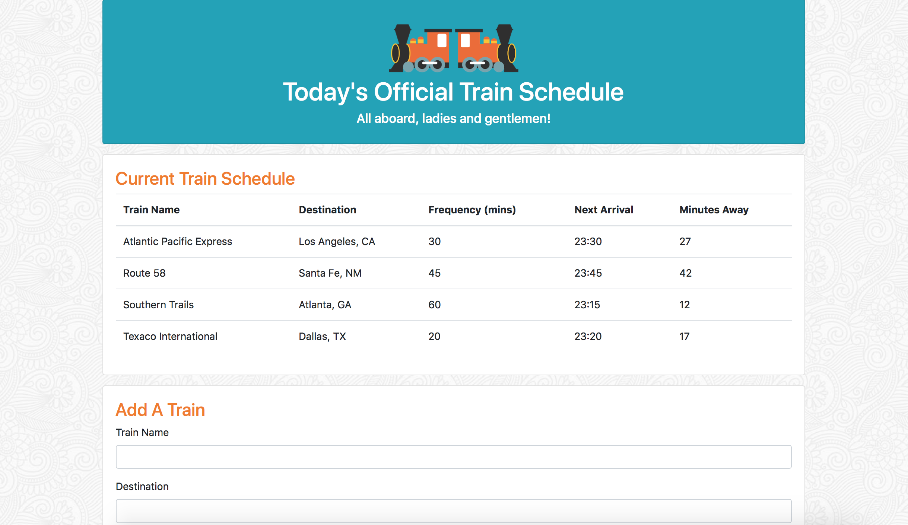

# Train Schedule Database

### About The Project
This project uses HTML, CSS, Bootstrap, Javascript, Moment JS, and Firebase to create a web page that displays a dynamic train schedule.

Users can add in their own train information - name, destination, the first time the train arrives, and the frequency of the train.

The submissions are stored in Firebase and then displayed on the web page in a table. Moment JS allows the program to calculate the time for the next arrival of the train, and how many minutes away the train is.

### To See The Project
Go to [this page](https://carmcollins.github.io/train-schedule/) and add a train!

